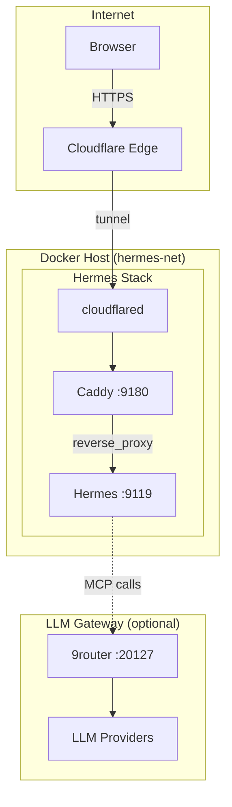

# Hermes Sandbox Deployment

Containerized deployment for **Hermes**, an AI-agent sandbox with a web dashboard. Run multiple AI worker agents (`coder`, `reviewer`, `tester`, ...) that collaborate on Kanban-tracked tasks inside isolated git worktrees — all exposed through a browser dashboard on port `9119`.

This repo contains the full deployment stack: the Hermes container, a Caddy reverse proxy, and an optional Cloudflare Tunnel (cloudflared) for secure public access without inbound firewall ports.

## Architecture



**Services:**

| Service | Port | Description |
|---------|------|-------------|
| **Hermes** | 9119 | AI agent sandbox + web dashboard (Kanban board) |
| **Caddy** | 9180 | Reverse proxy, terminates HTTP for `$HERMES_DOMAIN` |
| **cloudflared** | — | Outbound-only Cloudflare Tunnel (no public IP needed) |
| **9router** (external) | 20127 | LLM/MCP gateway for model access |

**Key points:**

- **cloudflared** establishes an outbound-only tunnel to Cloudflare — no public IP or inbound firewall rules required.
- **Caddy** reverse-proxies `$HERMES_DOMAIN` to the Hermes dashboard.
- **Hermes** runs agent profiles (coder, reviewer, tester, etc.) with optional Kanban task orchestration.
- Connect to an **LLM gateway** (e.g., 9router) via `ROUTER9_GATEWAY_URL` for model access.

## Prerequisites

- [Docker](https://docs.docker.com/engine/install/) with Docker Compose v2+
- [Git](https://git-scm.com/)
- (Optional) [Cloudflare](https://www.cloudflare.com/) account with a tunnel token for public HTTPS access
- (Optional) An LLM gateway URL for model access (e.g., [9router](https://github.com/YOUR_ORG/9router))

## Quick Start

### 1. Clone and configure

```sh
git clone https://github.com/YOUR_USERNAME/hermes-sandbox-deploy.git
cd hermes-sandbox-deploy

cp .env.example .env
cp env/hermes.env.example env/hermes.env
```

### 2. Configure environment variables

Edit `.env` and `env/hermes.env` with your values — see [Environment Variables](#environment-variables).

### 3. Start the stack

```sh
docker compose up -d --build
docker compose ps
```

### 4. Access the dashboard

- **Local:** `http://localhost:9119`
- **Public (via tunnel):** `https://<HERMES_DOMAIN>` once the Cloudflare Tunnel is configured

## Environment Variables

Configuration is split between two files:

| File | Purpose |
|------|--------|
| `.env` | Deployment-level values for `docker-compose.yml` |
| `env/hermes.env` | Runtime credentials for the Hermes container |

### `.env`

| Variable | Description | Example |
|----------|-------------|---------|
| `HERMES_DOMAIN` | Public domain served by Caddy/Cloudflare | `hermes.example.com` |
| `ROUTER9_GATEWAY_URL` | LLM/MCP gateway URL | `http://gateway:20127/api/mcp-gateway` |
| `ROUTER9_GATEWAY_KEY` | API key for the gateway | `your-api-key` |
| `CLOUDFLARED_TOKEN` | Cloudflare Tunnel token | *(from Zero Trust dashboard)* |

### `env/hermes.env`

| Variable | Description |
|----------|-------------|
| `ROUTER9_GATEWAY_URL` | Gateway URL (container-internal) |
| `ROUTER9_GATEWAY_KEY` | Gateway API key |
| `GH_TOKEN` | GitHub token for `gh` CLI access |
| `GITLAB_TOKEN` | GitLab token for `glab` CLI access |
| `AUX_MODEL` | Model for Kanban task decomposition |

> **Security:** Never commit `.env` or `env/hermes.env`. Both are git-ignored. Use the `.example` files as templates.

## Public Deploy (Cloudflare Tunnel + Caddy)

This stack uses Cloudflare Tunnel for secure public access without exposing ports:

### 1. Create a Cloudflare Tunnel

1. Go to [Cloudflare Zero Trust Dashboard](https://one.dash.cloudflare.com/)
2. Navigate to **Access → Tunnels**
3. Create a new tunnel and copy the tunnel token
4. Add the token to `.env` as `CLOUDFLARED_TOKEN`

### 2. Configure DNS

In your Cloudflare DNS settings, add a CNAME record pointing your domain to the tunnel:

```
hermes.example.com  →  <tunnel-id>.cfargotunnel.com
```

### 3. Update Caddyfile (optional)

The default `proxy/Caddyfile` uses `$HERMES_DOMAIN` from the environment. Modify if needed:

```caddyfile
http://{$HERMES_DOMAIN} {
    reverse_proxy hermes:9119 {
        flush_interval -1
    }
    encode zstd gzip
}
```

### 4. Deploy

```sh
docker compose up -d --build
```

The tunnel will automatically connect to Cloudflare and route traffic to Caddy.

## CI/CD Setup (GitHub Actions)

A workflow (`.github/workflows/deploy.yml`) auto-deploys on push to `master`:

### Workflow triggers

- Push to `master`
- Manual trigger (`workflow_dispatch`)
- Repository dispatch event (`deploy`)

### Required secrets

Configure in **Settings → Secrets and variables → Actions**:

| Secret | Description |
|--------|-------------|
| `VPS_HOST` | SSH host of your VPS |
| `VPS_USER` | SSH username |
| `VPS_SSH_KEY` | Private SSH key for deployment |

### VPS preparation

Before the first deploy, prepare the VPS:

```sh
# Create deploy directory and data volumes
sudo mkdir -p /opt/hermes-sandbox/data/{hermes,workbench,ssh}
sudo chown -R 1000:1000 /opt/hermes-sandbox/data/

# Create env files from examples
cd /opt/hermes-sandbox
cp .env.example .env
cp env/hermes.env.example env/hermes.env
# Edit both files with real values
```

The CI workflow syncs `docker-compose.yml`, `proxy/`, and `cloudflared/` to the VPS, then restarts:

```sh
cd /opt/hermes-sandbox
docker compose up -d --remove-orphans
```

## Standalone vs Gateway Setup

### Standalone (default)

The base `docker-compose.yml` runs all services on an isolated `hermes-net` bridge:

```sh
docker compose up -d --build
```

Hermes connects to any gateway via a routable URL:
- Local dev: `http://host.docker.internal:20127/api/mcp-gateway`
- Remote: `https://your-gateway.example.com/api/mcp-gateway`

### With co-located 9router

If running 9router on the same host, use the override file to join its Docker network:

```sh
docker compose -f docker-compose.yml -f docker-compose.vps.yml up -d --build
```

This attaches Hermes to the `9router_9router-net` network (must already exist). Set:

```sh
ROUTER9_GATEWAY_URL=http://9router-api:20127/api/mcp-gateway
```

## Project Structure

```
hermes-sandbox-deploy/
├── docker-compose.yml        # Main compose file
├── docker-compose.vps.yml    # Override for shared network setup
├── Dockerfile                # Hermes container build
├── .env.example              # Deployment env template
├── .github/
│   └── workflows/
│       └── deploy.yml        # CI/CD workflow
├── cloudflared/
│   └── config.yml.example    # Cloudflare tunnel config template
├── config/
│   ├── config.yaml           # Hermes configuration
│   └── mcp.json              # MCP gateway wiring
├── env/
│   └── hermes.env.example    # Container env template
├── proxy/
│   └── Caddyfile             # Caddy reverse proxy config
└── scripts/
    └── entrypoint.sh         # Container entrypoint
```

## Contributing

1. Fork the repository
2. Create a feature branch
3. Submit a pull request

## License

[MIT](LICENSE)
