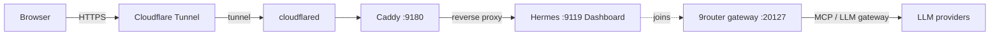

# Hermes Sandbox Deployment

Containerized deployment for **Hermes**, an AI-agent sandbox with a web dashboard. Run multiple AI worker agents (`coder`, `reviewer`, `tester`, ...) that collaborate on Kanban-tracked tasks inside isolated git worktrees — all exposed through a browser dashboard on port `9119`.

This repo contains the full deployment stack: the Hermes container, a Caddy reverse proxy, and a Cloudflare Tunnel (cloudflared) that exposes the dashboard without opening inbound firewall ports.

## Architecture



- **cloudflared** establishes an outbound-only connection to Cloudflare, so no public IP or inbound firewall rules are needed.
- **Caddy** terminates HTTP and reverse-proxies `$HERMES_DOMAIN` to the Hermes dashboard on port `9119`.
- **Hermes** runs the agent sandbox and dashboard, and joins the shared `9router_9router-net` network when deployed alongside a 9router gateway to reach the LLM/MCP gateway at `ROUTER9_GATEWAY_URL`.

## Prerequisites

- [Docker](https://docs.docker.com/engine/install/) with Docker Compose v2
- A [Cloudflare](https://www.cloudflare.com/) account with a tunnel token for the target domain
- A running [9router](https://github.com/vianhanif/9router) gateway instance (for LLM/MCP access); for local testing, a reachable gateway URL is enough
- Git

## Quick Start

1. **Clone and configure**

   ```sh
   git clone <your-repo-url> hermes-sandbox-deploy
   cd hermes-sandbox-deploy

   cp .env.example .env
   cp env/hermes.env.example env/hermes.env
   ```

2. **Configure environment variables** — set `HERMES_DOMAIN`, `CLOUDFLARED_TOKEN`, gateway credentials, and tokens in `.env` and `env/hermes.env` (see [Environment Variables](#environment-variables)).

3. **Start the stack**

   ```sh
   docker compose up -d --build
   docker compose ps
   ```

4. **Open the dashboard** at `http://localhost:9119`, or at your `HERMES_DOMAIN` once the tunnel is up.

## Environment Variables

Configuration is split between two files:

- `.env` — deployment-level values used by `docker-compose.yml` (domain, tunnel, gateway).
- `env/hermes.env` — runtime credentials injected into the Hermes container.

### `.env`

| Variable | Description | Example |
|---|---|---|
| `HERMES_DOMAIN` | Public domain served by Caddy/Cloudflare | `hermes.example.com` |
| `ROUTER9_GATEWAY_URL` | URL of the 9router LLM/MCP gateway | `http://hermes-gateway-public:20127/api/mcp-gateway` |
| `ROUTER9_GATEWAY_KEY` | API key for the 9router gateway | `REPLACE_ME` |
| `CLOUDFLARED_TOKEN` | Cloudflare Tunnel token | *(from Cloudflare Zero Trust dashboard)* |

### `env/hermes.env`

| Variable | Description | Example |
|---|---|---|
| `ROUTER9_GATEWAY_URL` | Gateway URL inside the container. VPS: `http://9router-api:20127/api/mcp-gateway`; local: `http://host.docker.internal:20127/api/mcp-gateway` | — |
| `ROUTER9_GATEWAY_KEY` | API key for the 9router gateway | — |
| `GH_TOKEN` | GitHub token for tool access | — |
| `GITLAB_TOKEN` | GitLab token for tool access | — |
| `AUX_MODEL` | Auxiliary model used for Kanban task decomposition | — |

> Never commit `.env` or `env/hermes.env`. Both are git-ignored; the `.example` files are the source of truth for required keys.

## Deployment

### GitHub Actions

A CI workflow (`.github/workflows/deploy.yml`) deploys to a target VPS on every push to `master` (and via `workflow_dispatch` or a `deploy` repository dispatch event).

The workflow syncs `docker-compose.yml`, `proxy/`, and `cloudflared/` to the VPS, then restarts the stack:

```sh
cd /opt/hermes-sandbox
docker compose up -d --remove-orphans
```

#### Required secrets

Configure these in your GitHub repository under **Settings → Secrets and variables → Actions**:

| Secret | Description |
|---|---|
| `TENCENT_HOST` | SSH host of the VPS |
| `TENCENT_USER` | SSH username |
| `TENCENT_SSH_KEY` | Private SSH key for deployment |

The VPS must already have `.env`, `env/hermes.env`, and the required data volumes in place at the deploy target directory, since the workflow only syncs the compose file and config directories.

## Public vs Personal VPS Setup

- **Base `docker-compose.yml`** runs standalone: Hermes, Caddy, and cloudflared on an isolated `hermes-net` bridge. Hermes talks to the gateway over a routable URL (`host.docker.internal` locally, or the gateway's published hostname on the VPS).

- **Alongside a shared 9router stack** (personal setup): add the 9router network via the override file so Hermes can reach the gateway on the private Docker network:

  ```sh
  docker compose -f docker-compose.yml -f docker-compose.vps.yml up -d --build
  ```

  `docker-compose.vps.yml` attaches the Hermes service to the external `9router_9router-net` network, which must already exist on the host (created by the 9router stack). When joined, point `ROUTER9_GATEWAY_URL` at the internal service name, e.g. `http://9router-api:20127/api/mcp-gateway`.

## License

[MIT](LICENSE)
